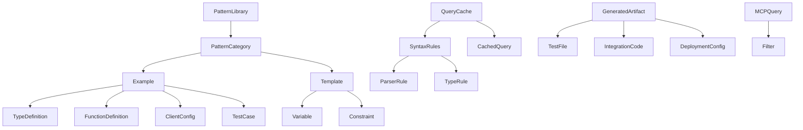

# Data Model: BAML Code Generation Skill

**Feature**: 001-baml-codegen-skill
**Date**: 2025-01-25
**Status**: Complete

## Entity Definitions

### 1. PatternLibrary

**Description**: Central repository of code patterns extracted from official BAML repositories, organized by use case.

**Fields**:
```yaml
PatternLibrary:
  id: string # Unique identifier
  version: string # Semantic version (e.g., "1.0.0")
  last_updated: datetime # Last repository sync
  patterns: Map<PatternType, PatternCategory>
  metadata:
    source_commit: string # Git commit hash from repository
    extraction_date: datetime
    total_patterns: int
```

### 2. PatternCategory

**Description**: Grouping of related patterns by use case (extraction, classification, RAG, agents).

**Fields**:
```yaml
PatternCategory:
  type: PatternType # enum: extraction|classification|rag|agents
  triggers: string[] # Keywords that activate this pattern
  examples: Example[] # Repository examples
  templates: Template[] # Synthesized templates
  optimizations: OptimizationRule[]
  priority: int # Selection priority (1-100)
```

### 3. Example

**Description**: Concrete example extracted from BAML repositories.

**Fields**:
```yaml
Example:
  id: string # Unique identifier
  name: string # Example name (e.g., "invoice_extraction")
  source_path: string # Repository path
  repository: string # baml_Docs or baml_Examples
  components:
    types: TypeDefinition[]
    functions: FunctionDefinition[]
    clients: ClientConfig[]
    tests: TestCase[]
  metadata:
    complexity: enum # simple|medium|complex
    token_count: int
    success_rate: float # Historical success rate
```

### 4. Template

**Description**: Reusable code template synthesized from multiple examples.

**Fields**:
```yaml
Template:
  id: string # Unique identifier
  name: string # Template name
  pattern_type: PatternType
  structure:
    base_code: string # Template with placeholders
    variables: Variable[] # Placeholder definitions
    constraints: Constraint[] # Validation rules
  usage_stats:
    times_used: int
    success_rate: float
    average_tokens: int
```

### 5. SyntaxRules

**Description**: BAML language syntax and grammar rules extracted from parser.

**Fields**:
```yaml
SyntaxRules:
  version: string # BAML version
  grammar:
    keywords: string[] # Reserved keywords
    operators: string[] # Valid operators
    directives: Directive[] # @function, @client, etc.
  types:
    primitives: PrimitiveType[]
    collections: CollectionType[]
    complex: ComplexType[]
  validation:
    parser_rules: ParserRule[]
    type_checking: TypeRule[]
  last_updated: datetime
```

### 6. QueryCache

**Description**: Multi-tier cache for MCP queries and generated patterns.

**Fields**:
```yaml
QueryCache:
  session:
    queries: Map<string, CachedQuery>
    ttl: int # Time-to-live in seconds (900)
    max_size: int # Max entries (100)
  permanent:
    core_syntax: SyntaxRules
    type_definitions: TypeDefinition[]
    common_patterns: Template[]
  statistics:
    hit_rate: float
    avg_response_time: int # milliseconds
    cache_size: int # bytes
```

### 7. GeneratedArtifact

**Description**: Complete package generated for user requirements.

**Fields**:
```yaml
GeneratedArtifact:
  id: string # Unique generation ID
  request:
    requirements: string # User's original request
    pattern_matched: PatternType
    language: string # python|typescript|ruby
  output:
    baml_code: string # Generated BAML code
    tests: TestFile[]
    integration: IntegrationCode
    deployment: DeploymentConfig
  metadata:
    generation_time: int # milliseconds
    token_count: int
    optimization_savings: float # percentage
    quality_score: float # 0-100
  validation:
    syntax_valid: bool
    types_correct: bool
    tests_pass: bool
```

### 8. MCPQuery

**Description**: MCP server query request and response.

**Fields**:
```yaml
MCPQuery:
  id: string # Query ID
  type: enum # fetch|search|validate
  server: string # baml_Docs|baml_Examples
  query:
    pattern: string # Search pattern
    filters: Filter[]
    pagination:
      page: int
      size: int
  response:
    results: any[] # Query results
    token_count: int
    latency: int # milliseconds
    cached: bool
  timestamp: datetime
```

## Relationships



## State Transitions

### Pattern Library States
```
UNINITIALIZED -> LOADING -> READY -> UPDATING -> READY
                    ↓         ↓         ↓
                  ERROR     ERROR     ERROR
```

### Generation Pipeline States
```
IDLE -> ANALYZING -> MATCHING -> GENERATING -> OPTIMIZING -> VALIDATING -> COMPLETE
           ↓            ↓            ↓             ↓             ↓
         FAILED      FAILED      FAILED        FAILED        FAILED
```

### Cache States
```
EMPTY -> POPULATING -> WARM -> HOT -> STALE -> REFRESHING -> WARM
             ↓           ↓       ↓       ↓          ↓
           ERROR      EXPIRED EXPIRED  ERROR     ERROR
```

## Validation Rules

### Pattern Validation
- Pattern must have at least one trigger keyword
- Examples must reference valid repository paths
- Templates must have complete variable definitions
- Optimization rules must be measurable

### Syntax Validation
- All keywords must be lowercase
- Directives must start with '@'
- Type names must be PascalCase
- Function names must be camelCase or PascalCase

### Cache Validation
- Session cache entries expire after TTL
- Permanent cache validates against repository commit
- Query results must match expected schema
- Token counts must not exceed limits

### Generation Validation
- Generated code must parse successfully
- All referenced types must be defined
- Test coverage must be 100%
- Integration code must match target language

## Performance Constraints

### Memory Limits
- Pattern Library: <10MB in memory
- Session Cache: <2MB per session
- Query Results: <1MB per query
- Generated Artifacts: <100KB per generation

### Latency Requirements
- Pattern matching: <100ms
- Code generation: <5s simple, <30s complex
- Cache lookup: <10ms
- MCP query: <500ms average

### Token Budgets
- Skill core: 3800 tokens
- Single pattern: <500 tokens
- Generated code: <5000 tokens typical
- Test suite: <2000 tokens

## Data Retention

### Permanent Storage
- Core syntax rules: Never expire
- Common patterns: Update weekly
- Usage statistics: Retain 90 days

### Session Storage
- Query cache: 15 minute TTL
- Generation history: Duration of session
- User preferences: Session lifetime

### Temporary Storage
- MCP responses: 5 minute cache
- Validation results: Single use
- Error logs: 24 hours